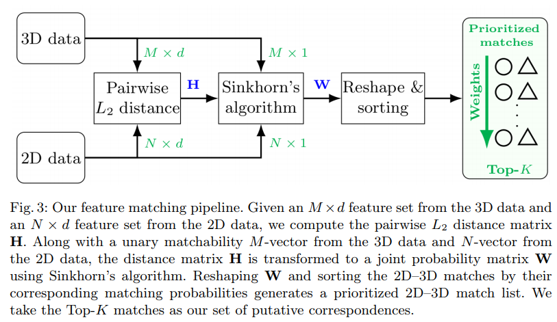

# Learning 2D–3D Correspondences To Solve The Blind Perspective-n-Point Problem

This contains the datasets and codes for training the deep blind PnP method described in : [Learning 2D–3D Correspondences To Solve The Blind Perspective-n-Point Problem.](https://arxiv.org/pdf/2003.06752.pdf) It also serves as the foundation for method described in : [Solving the Blind Perspective-n-Point Problem End-To-End With Robust Differentiable Geometric Optimization (ECCV2020, Oral)](https://arxiv.org/pdf/2007.14628.pdf).

# Contribution in Sentences

Given two sets (one 3D and one 2D this paper), and you want to estimate matches.  1) extract point-wise features; 2) estimate a joint probability matrix; 3) take the top-K matches from the probability matrix.




# Datasets
Please download synthetic [ModelNet40](https://drive.google.com/file/d/1Tj7rN4g3xY8ODQbMtrqyPyCsnttem6v9/view?usp=sharing), [NYU-RGBD](https://drive.google.com/file/d/1lTZH90zL3roNgHSkynXURmlGGfYyeKT6/view?usp=sharing) and real-world [MegaDepth](https://drive.google.com/file/d/1DKBgayxu0iPXqB-fiCKBWkP4OhuXV-im/view?usp=sharing) datasets.

# Codes and Models

## Prerequisites
Pytorch=1.1.0 : (This is the version on my PC, but I think it also works on yours)

numpy

opencv

tensorboardX

easydict

logging

json

If you find missing Prerequisites, please Google and install them using conda or pip

## Overview
Our model is implemented both in Tensorflow and Pytorch. Currently, only Pytorch codes are uploaded.
All our models are trained from scratch, so please run the training codes to obtain models.

For pre-trained models, please refer to [PreTrainModel folder](./output). Under the folder of each dataset, there is a folder named preTrained and you can find it there.

## Training

Run: 
```diff
python main_blindPnP.py
```
Before run the script, please modify the configurations directly in the script or in config.py, specifically:

You need to select the used dataset (configs.dataset) and change the directory of the dataset (configs.data_dir)

## Testing

Run:
```diff
python main_test.py
```

If you have questions, please first refer to comments in scripts.

# Modifications

1) Learning rate is set to 1e-3 for MegaDepth dataset and 1e-4 for ModelNet40 and NYU-RGBD. I found better performance can be obtained by just simply changing the learning rate one day, instead of using 1e-5 as reported in the paper.

2) If you want to use a classification network [Section 3.4 Correspondence Set Refinement] to polish the 3D-2D matches, please modify the network proposed in [Learning to Find Good Correspondences](https://github.com/vcg-uvic/learned-correspondence-release) following the guideline in [tf_pose_loss.py](./utils/tf_pose_loss.py)

# Q/A

1) Can this paper be used in partial-to-partial matching? Yes.
2) Can this paper be used in a real-world localization scenario? Yes.

I have done experiments to verify the above answers.

# Publications

If you like, you can cite the following publication:

*Liu, Liu, Dylan Campbell, Hongdong Li, Dingfu Zhou, Xibin Song, and Ruigang Yang. "Learning 2D-3D Correspondences To Solve The Blind Perspective-n-Point Problem." arXiv preprint arXiv:2003.06752 (2020).*

<pre>
@article{liu2020learning,
  title={Learning 2D-3D Correspondences To Solve The Blind Perspective-n-Point Problem},
  author={Liu, Liu and Campbell, Dylan and Li, Hongdong and Zhou, Dingfu and Song, Xibin and Yang, Ruigang},
  journal={arXiv preprint arXiv:2003.06752},
  year={2020}
}
</pre>

And also the following publication:

Dylan Campbell &ast;, Liu, Liu &ast; and Stephen Gould. "Solving the Blind Perspective-n-Point Problem End-To-End with Robust Differentiable Geometric Optimization." In Proceedings of the European Conference on Computer Vision (ECCV), 2020. (* indicates equal contribution)


<pre>
@inproceedings{CampbellAndLiu:ECCV2020,
  author = {Dylan Campbell$^\ast$ and Liu Liu$^\ast$ and Stephen Gould},
  title = {Solving the Blind Perspective-n-Point Problem End-To-End with Robust Differentiable Geometric Optimization},
  booktitle = {ECCV},
  year = {2020},
  note = {$^\ast$ equal contribution},
}
</pre>


# Contact

If you have any questions (NOT those you can find answers via Google), drop me an email (Liu.Liu@anu.edu.au)


